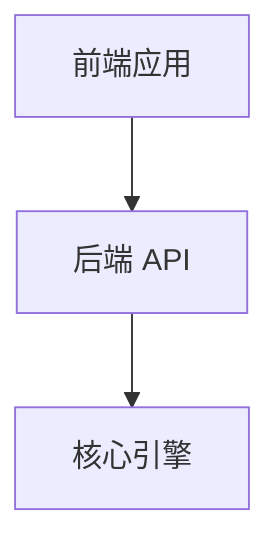
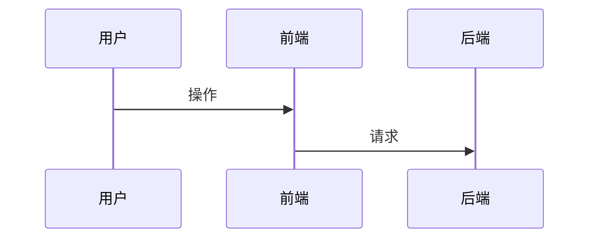

# openspec-wiki 页面模板与写作规范

生成任何 Wiki 页面前先读本文件。所有页面：简体中文；头部用引用行注明生成来源；不虚构 openspec 里没有的内容。

## 1. 能力页 `wiki/specs/<capability>.md`

```markdown
# <能力名（中文标题，取自 Purpose 概括）>

> 源规格：`openspec/specs/<capability>/spec.md` · 由 openspec-wiki 生成 · 请勿手改，改规格后重新运行同步

## 这是什么

<把 spec 的 ## Purpose 改写成 1-3 句：这个能力负责什么、边界在哪、和哪些能力相关。
 相关能力用 [能力名](<capability>.md) 链接。>

## 需求契约

<每个 ### Requirement 一小节，保留原需求标题与 SHALL/MUST 语义：>

### <Requirement 原标题>

- <契约要点：用 1-2 句说清"系统必须保证什么"，保留 SHALL/MUST/ numbers / 常量。>

| 场景 | WHEN | THEN |
|------|------|------|
| <场景名> | <触发条件> | <预期行为> |

<场景多于 4 个时可只列关键场景并注明"更多场景见源规格"。>
```

写作红线：
- 需求标题不改写（便于和 spec 对照）。
- 数字、常量、阈值、角色名、文件名一律原样保留。
- 场景表是"行为示例"，不是全文翻译；语义不得增删。

## 2. 变更日志 `wiki/changelog.md`

文件头：

```markdown
# 变更日志

> 由 openspec-wiki 从 `openspec/changes/archive/` 生成 · 倒序 · 请勿手改

## 进行中

<有 openspec/changes/* 活跃变更时逐条列出：`- <change-id>：<proposal 的 Why 一句话>（进行中，归档后自动转正）`；无则写"暂无"。此节不记入账本，每次同步时刷新。>
```

每条已归档变更（**倒序插在"进行中"节之后、旧条目之前**）：

```markdown
## <YYYY-MM-DD> <change-id>

- **为什么**：<proposal Why 的 1-2 句概括>
- **改了什么**：<What Changes 的要点，1-3 条；无则省略此行>
- **影响能力**：<每个能力一个链接，如 [judge-grading-pipeline](specs/judge-grading-pipeline.md)，多个用顿号分隔>
- 详情：[`openspec/changes/archive/<目录名>/proposal.md`](../openspec/changes/archive/<目录名>/proposal.md)
```

能力被整体移除（capabilitiesRemoved）时追加特殊条目：

```markdown
## <同步日期> （能力移除）

- **<capability>** 已从规格中移除，对应 Wiki 页面已删除。来源变更：<change-id>
```

## 3. 总览页 `wiki/README.md`

```markdown
# <项目名> Wiki

> 由 openspec-wiki 基于 `openspec/` 规格文档生成 · 请勿手改，改规格后重新运行同步

<项目简介：来自 openspec/project.md 或项目 README.md 的开头部分，2-4 句。
 config.yaml 的 context（技术栈、约定）存在时并入一段"技术栈与约定"。>

## 文档地图

| 页面 | 内容 | 什么时候读 |
|------|------|-----------|
| [architecture.md](architecture.md) | 系统定位、分层、能力依赖、关键流程、部署、架构约束 | 想快速理解系统整体怎么搭的 |
| [api.md](api.md) | HTTP 接口清单（方法 / 路径 / 用途 / 权限 / 源位置） | 要调用或改动接口 |
| [data-model.md](data-model.md) | 领域实体与关系、表结构、迁移 | 要动数据或写 SQL |
| [integrations.md](integrations.md) | 第三方接口、消息队列、外部进程、运行时依赖 | 排查外部依赖或做集成 |
| [decisions.md](decisions.md) | 架构决策记录（含否决方案与理由） | 想知道"为什么这么设计" |
| [glossary.md](glossary.md) | 领域术语表 | 遇到不熟的术语 |
| [changelog.md](changelog.md) | 变更日志（倒序） | 想知道最近改了什么 |
| `specs/*.md` | 各能力的需求契约与行为场景 | 要看某个能力的精确验收标准 |

<文档地图必须完整列出实际存在的页面。某页因素材缺失未生成时，在该行标注"（暂缺：<原因>）"，不要留空行。>

## 能力地图

| 能力 | 说明 | 文档 |
|------|------|------|
| <capability> | <Purpose 的一句话概括> | [查看](specs/<capability>.md) |

<全部能力都要在表里，按字母序。>

## 进行中变更

<同 changelog 的"进行中"节；无则写"暂无"。>

## 最近变更

<最近 5 条归档变更：`- <日期> [<change-id>](changelog.md#<日期>-<change-id>)：<一句话>`；链接锚点不必精确，统一链到 changelog.md 即可。>
```

## 4. 架构页 `wiki/architecture.md`

**这是唯一的综合推断页**：事实源分散在总览文档、目录结构、依赖清单与各 design.md 之间，必须逐节标注来源；推不出来的内容写进末节"待补"，不得编造。

```markdown
# 系统架构

> 由 openspec-wiki 生成 · 综合推断页，各节标注来源 · 请勿手改，改规格后重新运行同步

## 系统定位与技术栈

<来自总览源（project.md 或 README）的前置环境 / 技术栈段落 + 依赖文件。
 列清：语言与运行时、主要框架、关键依赖及其用途。标注来源文件。>

## 分层与构建块

<基于目录结构与能力集合聚类，不要凭空分层。>

| 层 | 模块 | 路径 | 职责 |
|----|------|------|------|



## 能力依赖关系

<从 specs 的 Requirement 与场景描述里识别能力间引用（谁调用谁、谁依赖谁的数据）。>


<无法确定的边不要臆造；存疑时在图下注明"以下关系待确认：…"。>

## 端到端关键流程

<2-3 条**跨能力**流程，用 mermaid sequenceDiagram。优选取：主业务链路、
 生命周期链路（如 草稿→发布→关闭）、导入导出链路。单能力内部细节交给 specs 页。>



## 部署与运行

<启动方式（start.sh / npm run 等）、进程模型、监听端口、外部进程依赖。
 来源：依赖文件、启动脚本、design.md 中的部署类约束。>

## 架构约束与不变量

<汇总全部 design.md 的「约束 / 前提 / 非目标」节。每条注明来源 change-id。>

| 约束 | 内容 | 来源 |
|------|------|------|

## 待补（需人工输入）

<openspec 与代码都推不出来的内容：性能指标、可用性目标、利益相关者、外部系统边界、
 数据量级与容量规划。列成待办清单，明确写"待补：需人工输入"。禁止编造。>
```

## 5. 决策记录 `wiki/decisions.md`

```markdown
# 架构决策记录（ADR）

> 由 openspec-wiki 从 `openspec/changes/archive/*/design.md` 生成 · 倒序 · 请勿手改

## <YYYY-MM-DD> <change-id>：<决策主题>

- **背景**：<design.md 的 Context，1-3 句>
- **决策**：<逐条列出 Decisions 节，保留 D1 / D2 编号与方案名>
- **否决方案**：<每个被否方案 + 否决理由；这是最稀缺的信息，必须保留>
- **风险与权衡**：<Risks / Trade-offs 要点>
- **待决问题**：<Open Questions；无则省略此行>
- **影响能力**：<能力链接，顿号分隔>
- 详情：`openspec/changes/archive/<目录名>/design.md`
```

写作红线：
- **"否决方案及理由"不得省略或压缩成"见原文"** —— 它解释了"为什么不能那样做"，是决策页存在的首要价值。
- 数字、常量、参数名（如并发数、超时值、环境变量名）原样保留。
- 新条目**倒序插在最上方**（最新决策在最前）。

## 6. 术语表 `wiki/glossary.md`

```markdown
# 术语表

> 由 openspec-wiki 从 specs 提取 · 按术语首字排序 · 请勿手改

| 术语 | 含义 | 出现能力 |
|------|------|----------|
| <术语> | <基于规格中实际用法的定义，1-2 句> | [<能力>](specs/<capability>.md) |
```

规则：只收规格里**真实出现**的术语——包括专有流程名、角色名、行内代码标识符（如字段名、环境变量、包格式名）。不引入外部百科式解释，不收录通用编程词汇。

## 7. 接口清单 `wiki/api.md`

事实源为 `extract` 子命令的 `api` 输出（含 `groups` / `auxiliaryGroups`），**不要重新读源码**。

两层结构：**组内一览表**保证通读性，**端点详情（折叠）**承载完整字段结构与 curl。

```markdown
# API 接口清单

> 由 openspec-wiki 从代码声明提取 · 共 N 个端点 · 字段结构来源逐条标注

## 鉴权与角色

<从各端点的 permissions 归纳：角色清单、鉴权方式、哪些端点免鉴权。>

## `<路由前缀>`（N 个）

| 方法 | 路径 | 用途 | 权限 | 请求字段 | 响应 |
|------|------|------|------|----------|------|
| POST | `/api/exams` | 创建考试 | admin | `name:string*` `duration_min:integer*` `student_count:integer*` `question_ids:array` | `object{id,name,duration_min,student_count,status,question_count,question_ids,created_at}` |

<紧凑写法：`字段:类型` 以空格分隔，末尾 `*` 表示必填，无 `*` 表示可选；
 required 为 null 的加 `?`（如 `name:string?`，含义"待确认"）。
 响应写 `object{…}` / `array<object{…}>` / `file(text/csv)`；字段多时只列前 8 个再写 `…`。
 用途取自函数名 / docstring / specs 语义，一句话。>

<details>
<summary><code>POST /api/exams</code> — 创建考试</summary>

- 权限：`platform_admin` / `admin`（`Depends(AdminDep)`）
- 源位置：`backend/app/routers/exams.py:224`
- 请求体（JSON）：

| 字段 | 类型 | 必填 | 默认 | 说明 |
|------|------|------|------|------|
| name | string | 是 | — | 考试名称 |
| duration_min | integer | 是 | — | 考试时长（分钟），须 > 0 |
| student_count | integer | 是 | — | 考生人数，创建时自动生成账号 |
| question_ids | array | 否 | `[]` | 关联题目 ID 列表 |

- 响应 `object`（源：`_exam_public()` · `backend/app/routers/exams.py`）：

| 字段 | 类型 | 说明 |
|------|------|------|
| id | INTEGER | 考试 ID（取自表 `exams`） |
| … | | |

- 错误约定：

| 状态码 | 提示 |
|--------|------|
| 400 | 考试名称不能为空 |
| 400 | duration_min/student_count 必须为整数 |

```bash
curl -X POST 'http://localhost:8000/api/exams' \
  -H 'Content-Type: application/json' \
  -d '{"name":"2026 春招机考","duration_min":90,"student_count":30,"question_ids":[1,2,3]}'
```

</details>

<每个有字段结构或写操作的端点给一个折叠块；纯查询且无字段线索的端点只留在一览表里。字段清单缺失的响应写"◐ 结构已知（kind），字段见 源位置"，不要留空表。>

## 辅助端点（测试 / mock / 非业务）

<来自 auxiliaryGroups：一句话说明来源，不逐条展开。>
```

写作红线：
- 方法、路径、权限字符串**原样保留**，不做美化或补全。
- **字段名、类型、必填一律取自 `extract` 输出**，不得臆造；`required` 为 `null` 的写"待确认"。
- 响应字段的 `源`（`dict literal` / `_helper() · file` / `SELECT 自 <表>` / `StreamingResponse()`）必须照录，便于人工回源核对。
- curl 示例的 body 只写请求字段表里确有依据的键；签名里看不到的字段不要写。
- 端点数量多时按前缀分组，不要合并成一张巨型表；<details> 折叠保证首屏可通读。

## 8. 数据库设计 `wiki/data-model.md`

事实源为 `extract` 子命令的 `dataModel` 输出（`tables` 为核心表，`auxiliaryTables` 为辅助表）。

```markdown
# 数据库设计

> 由 openspec-wiki 从 DDL / ORM 声明提取 · 源位置逐表标注

## 业务设计（概念模型）

### 领域实体

| 实体 | 说明 | 关键关系 |
|------|------|----------|

### 实体关系图


<关系取自表名语义与外键声明；推断的关系必须标注"推断"。>

### 关键实体生命周期

<如 考试：草稿 → 发布 → 关闭；提交：草稿 → 提交 → 判分。来源：specs 中的状态相关需求。>

## 物理设计

> 列名 / 类型 / 约束来自 `extract` 的 `tables[].columns`，**原样照录**（大小写保持 DDL 原样）。

### 表 `<table_name>`

- 源位置：`<file>:<line>`（多处声明时全部列出，标出当前有效版本）
- 字段：

| 字段 | 类型 | 约束 | 说明 |
|------|------|------|------|
| id | INTEGER | PK, AUTO | |
| username | TEXT | NOT NULL, UNIQUE | 登录名 |
| … | | | |

- 索引 / 外键：<有则列（来自 indexes / 约束里的 FK→），无则写"无"；`> 推断` 标注靠表名语义推出的关系>

<逐表展开，全部核心表都要有。列的"说明"取 specs 语义；specs 未涉及则留空，不要编。

若某表的 `columns` 为空（技术栈未覆盖，如 JPA 注解式建模），写
 "◐ 表已识别，字段未提取（源位置见上），待补：需人工确认字段清单"。>

## 迁移与冗余声明

<同一张表出现多处声明时（迁移重建、ALTER / RENAME），列出历史与当前有效版本；
 来自 `tables[].occurrences` 与 `alterations`。>

## 辅助表（测试 / 种子示例）

<来自 auxiliaryTables：列出表名与来源文件，一句话说明不属业务表。
 若其中某张实为业务表，显式注明"疑为业务表，待确认"。>
```

写作红线：
- 列名与类型**照录 DDL**，不做驼峰 / 命名风格转换。
- `constraints` 数组里的 `PK / NOT NULL / UNIQUE / AUTO / DEFAULT x / FK→t / CHECK` 全部保留，不省略。
- DDL 里未声明的列**不得凭字段名猜测补全**；缺列就写"待补"。

## 9. 外部集成 `wiki/integrations.md`

事实源为 `extract` 子命令的 `integrations` 输出 + design.md 的 Non-Goals 节。适用于**所有项目**——即使某类为空也必须保留小节并写明依据。

```markdown
# 外部依赖与集成

> 由 openspec-wiki 从依赖清单与代码调用点提取 · 请勿手改

## 第三方接口

| 服务 | 用途 | 协议 / 客户端 | 调用点 | 现状 |
|------|------|--------------|--------|------|

<来源：httpCalls / sdkHints / urls。无法确定服务名的写"未识别（<URL 或配置键>）"。
 已下线但代码仍存在的调用，现状列写"已下线/已改离线"。>

## 消息队列

<有命中时：生产者 | 消费者 | 主题 / 队列 | 用途。
 无命中时必须写成："本项目未使用消息队列。"并附依据，例如
 design.md 中 <change-id> 的非目标明确"不引入消息队列，原因：…"。>

## 外部进程与工具链

| 依赖 | 用途 | 调用点 |
|------|------|--------|

<来自 externalProcesses 与运行时版本要求（编译器、解释器、JDK 等）。>

## 运行时依赖

<requirements.txt / package.json 等依赖清单的关键条目 + 源文件路径。
 只列实际用到的关键依赖，不必照抄全部。>

## 明确不使用的能力（非目标）

<汇总 design.md 的 Non-Goals：每条 = 不做什么 + 为什么。这类"有意不引入"的结论
 能避免后来人反复重提已被否决的方案，必须保留。>
```

写作红线：
- 某类为**空集时不能删掉该节** —— "没有 + 依据"本身就是架构结论。
- URL、配置键名、环境变量名原样保留；内网地址照录，不要改写成主机名或做匿名化。

## 10. 改写质量自检（生成后逐页过一遍）

1. 每个 Requirement 都有对应小节，标题未改名。
2. 场景表 WHEN/THEN 无语义增删；数字/常量/角色名未变。
3. 页内链接（能力互链、changelog→specs、README 文档地图→各页、架构页→能力页）全部有效。
4. 头部来源行存在且路径正确。
5. **architecture.md**：每节都有来源标注；"待补"节存在且未编造指标。
6. **decisions.md**：每条都含"否决方案及理由"，未压缩为"见原文"。
7. **api.md**：端点数量与 `extract` 输出的 `endpointCount` 一致；未出现凭空补全的字段。
8. **data-model.md**：核心表与 `tables` 一致；辅助表单独归类；关系图中推断的边已标注。
9. **integrations.md**：第三方接口 / 消息队列 / 外部进程 / 运行时依赖 / 非目标 五节齐全，空集也保留并说明依据。
